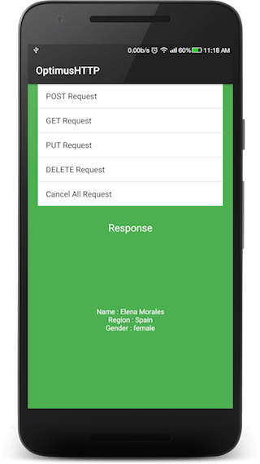

<h1 align="center"><a href="https://twitter.com/intent/tweet?text=Checkout%20OptimusHTTP%3A%20Android%20library%20that%20simplifies%20networking%20in%20android%20via%20an%20async%20http%20client%20%F0%9F%98%8E&via=nisrulz&hashtags=AndroidDev,android,library,OpenSource">
        
    </a></h1>

<div align="center">
  <strong>Android library that simplifies networking in android via an async http client.</strong>
</div>
<br/>
<div align="center">
    <!-- Bintray -->
    <a href="https://bintray.com/nisrulz/maven/com.github.nisrulz%3Aoptimushttp/_latestVersion">
        
    </a>
    <!-- API -->
    <a href="https://android-arsenal.com/api?level=14">
        
    </a>
    <!-- Android Arsenal -->
    <a href="https://android-arsenal.com/details/1/3592">
        
    </a>
    <!-- Android Dev Digest -->
    <a href="https://www.androiddevdigest.com/digest-100/">
        
    </a>
    <!-- GitHub stars -->
    <a href="https://github.com/nisrulz/OptimusHTTP">
        
    </a>
    <!-- GitHub forks -->
    <a href="https://github.com/nisrulz/OptimusHTTP/fork">
        
    </a>
    <!-- GitHub watchers -->
    <a href="https://github.com/nisrulz/OptimusHTTP">
        
    </a>
    <!-- Say Thanks! -->
    <a href="https://saythanks.io/to/nisrulz">
        
    </a>
    <a href="https://www.paypal.me/nisrulz/5">
        
    </a>
    <br/>
     <!-- GitHub followers -->
    <a href="https://github.com/nisrulz/OptimusHTTP">
        
    </a>
    <!-- Twitter Follow -->
    <a href="https://twitter.com/nisrulz">
        
    </a>
</div>

<div align="center">
    Also featured in [Awesome Android Newsletter
    <a href="https://android.libhunt.com/newsletter/15">
         #Issue 15
    </a>]
</div>

<div align="center">
  <sub>Built with ❤︎ by
  <a href="https://twitter.com/nisrulz">Nishant Srivastava</a> and
  <a href="https://github.com/nisrulz/OptimusHTTP/graphs/contributors">
    contributors
  </a>
</div>
<br/>
<br/>

# Including in your project
OptimusHTTP is available in the Jcenter, so getting it as simple as adding it as a dependency
```gradle
implementation 'com.github.nisrulz:optimushttp:{latest version}'
```
where `{latest version}` corresponds to published version in [  ](https://bintray.com/nisrulz/maven/com.github.nisrulz%3Aoptimushttp/_latestVersion)


# Usage
+ Setup your SERVER url
```java
String SERVER = "http://uinames.com/api/";
```

+ Create an instance of the ***OptimusHTTP*** class
```java
 OptimusHTTP client = new OptimusHTTP(context);
```

+ Next if in debug stage, enable logs
```java
client.enableDebugging();
```

+ Define parameters to be sent with the request
```java
ArrayMap<String, String> params = new ArrayMap<>();
params.put("email", "abc@abc.com");
params.put("pass", "abc");
```

+ Define configurations for the request
 + Type of Method : POST/GET
     + POST Request
    ```java
    client.setMethod(OptimusHTTP.METHOD_POST);
    ```
     + GET Request
    ```java
    client.setMethod(OptimusHTTP.METHOD_GET);
    ```
     + PUT Request
    ```java
    client.setMethod(OptimusHTTP.METHOD_PUT);
    ```
     + DELETE Request
    ```java
    client.setMethod(OptimusHTTP.METHOD_DELETE);
    ```
  
  + Type of Mode : PARALLEL/SEQ
     + Parallel Request
    ```java
    client.setMode(OptimusHTTP.MODE_PARALLEL);
    ```
     + Sequential Request
    ```java
    client.setMode(OptimusHTTP.MODE_SEQ);
    ```

  + Setup timeout values (optional, default is 10s)
      + Connect Timeout
     ```java
     client.setConnectTimeout(10 * 1000);
     ```
      + Read Timeout
     ```java
     client.setReadTimeout(10 * 1000);
     ```

  + Setup content type (optional, deafult is `CONTENT_TYPE_FORM_URL_ENCODED`)
       ```java
       client.setContentType(OptimusHTTP.CONTENT_TYPE_JSON);
       ```

      Available Types

        + `OptimusHTTP.CONTENT_TYPE_FORM_URL_ENCODED`
        + `OptimusHTTP.CONTENT_TYPE_JSON`
        + `OptimusHTTP.CONTENT_TYPE_PDF`
        + `OptimusHTTP.CONTENT_TYPE_HTML`
        + `OptimusHTTP.CONTENT_TYPE_IMG_PNG`
        + `OptimusHTTP.CONTENT_TYPE_TEXT`

  + Setup Headers (optional)
      ```java
      ArrayMap<String, String> headerMap = new ArrayMap<>();
      headerMap.put("Accept-Encoding", "gzip, deflate");
      headerMap.put("Accept-Language", "en-US");
      headerMap.put("Content-Language", "en-US");
      client.setHeaderMap(headerMap);
      ```

+ To make a request create an object of **HttpReq** class.
> The ***client.makeRequest()*** function returns reference to each ***HttpReq*** object created which you can save in an *ArrayList* and then later on call cancel function on them to *cancel* the requests

	```java
	
	ArrayList<HttpReq> refHttpReqList = new ArrayList<>();
	try {
	     // makeRequest() returns the reference of the request made
	     // which can be used later to call the cancelReq() if required
	     // if no request is made the makeRequest() returns null
	    HttpReq req = client.makeRequest(SERVER, params, responseListener);
	        if (req != null)
	            refHttpReqList.add(req);
	} catch (Exception e) {
	        e.printStackTrace();
	}
	```

+ To cancel one requests
```java
client.cancelReq(req);
```

+ To cancel all requests
```java
if (refHttpReqList.size() > 0) {
    for (int i = 0; i < refHttpReqList.size(); i++)
        client.cancelReq(refHttpReqList.get(i));
    refHttpReqList.clear();
}
```

+ Implement the Callback
```java
// Listener for the Response received from server
private final OptimusHTTP.ResponseListener responseListener = new OptimusHTTP.ResponseListener() {
        @Override
        public void onSuccess(String msg) {
            System.out.println(msg);
        }

        @Override
        public void onFailure(String msg) {
            System.out.println(msg);
        }
    };
```

## Screenshots



# Pull Requests
I welcome and encourage all pull requests. It usually will take me within 24-48 hours to respond to any issue or request. Here are some basic rules to follow to ensure timely addition of your request:
  1. Match coding style (braces, spacing, etc.) This is best achieved using CMD+Option+L (Reformat code) on Mac (not sure for Windows) with Android Studio defaults. This project uses a [modified version of Grandcentrix's code style](https://github.com/nisrulz/AndroidCodeStyle/tree/nishant-config), so please use the same when editing this project.
  2. If its a feature, bugfix, or anything please only change code to what you specify.
  3. Please keep PR titles easy to read and descriptive of changes, this will make them easier to merge :)
  4. Pull requests _must_ be made against `develop` branch. Any other branch (unless specified by the maintainers) will get rejected.
  5. Check for existing [issues](https://github.com/nisrulz/OptimusHTTP/issues) first, before filing an issue.
  6. Have fun!


## License
Licensed under the Apache License, Version 2.0, [click here for the full license](/LICENSE.txt).

## Author & support
This project was created by [Nishant Srivastava](https://github.com/nisrulz/nisrulz.github.io#nishant-srivastava) but hopefully developed and maintained by many others. See the [the list of contributors here](https://github.com/nisrulz/OptimusHTTP/graphs/contributors).

> If you appreciate my work, consider buying me a cup of :coffee: to keep me recharged :metal:
>  + [PayPal](https://www.paypal.me/nisrulz/5)
>  + Bitcoin Address: 13PjuJcfVW2Ad81fawqwLtku4bZLv1AxCL
>
> I love using my work and I'm available for contract work. Freelancing helps to maintain and keep [my open source projects](https://github.com/nisrulz/) up to date!

